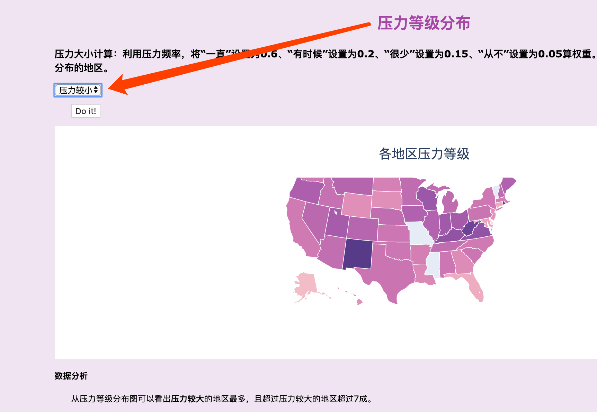
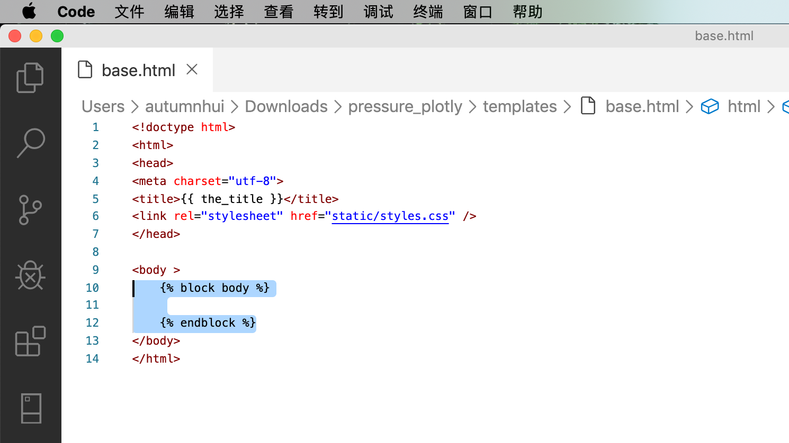
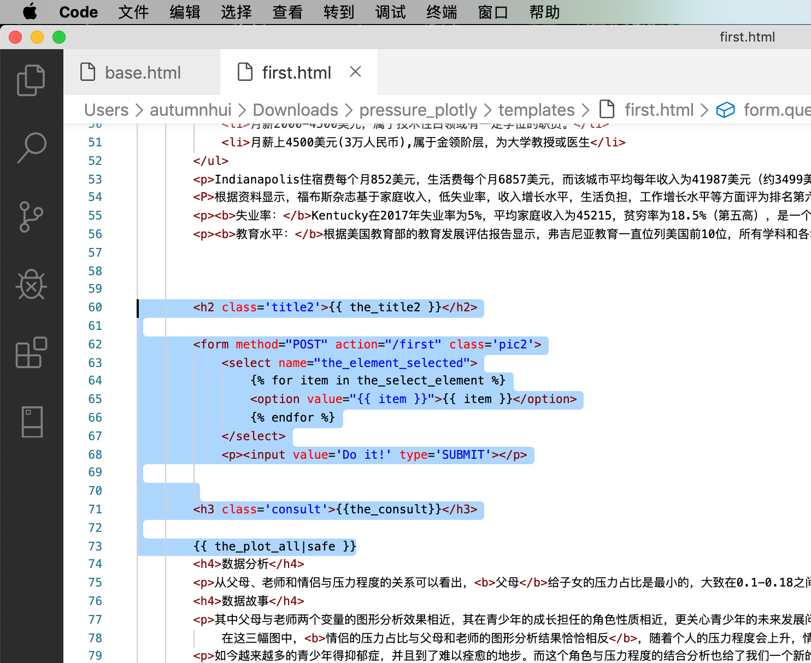

# 🐍Python期末项目

---

此项目为中大南方18级Python课程期末项目，与17级合作完成。

项目内容为通过使用Python完成数据处理、可视化操作，并部署于PythonAnywhere上展示。

[PythonAnywhere（👈点击展示）](http://pythonpressure.pythonanywhere.com/)

      

---

## 👍网页功能

##### 通过用户的选择主题，展示关于 *压力* 主题的内容。

1. 背景故事
2. 可视化数据
3. 相关分析/总结
4. 数据故事

## 📗使用方法
##### 🔑基本使用
用户选择相关主题，并点击提交，网页即呈现对应主题的内容以及分析、故事。

##### 🔐进阶使用
通过用户选择进行交互数据的筛选，并刷新页面呈现对应的结果页面（pythonanywhere加载巨慢）。

## 📝数据传递描述

##### 🐒数据结构的循环（截取部分展示，详见pressure.py）

    list4=[]
        for i in range(len(num_count)):

        list4.append(num_count[i])
    
        list4.append(num_count[i])
    
        list4.append(num_count[i])
    
        list4.append(num_count[i])
    
        list4.append(num_count[i])
    
        list4.append(num_count[i]) 
    
        ................

##### 🐻使用推导式（截取部分展示，详见pressure.py）

   
        ## 呈现问题表格

            data_pie1 = data_pie.T.to_html()
    
            pie1_list = [num for num in data_pie['分类']]
    
            labels = [index for index in data_pie.index]
    
            ### 设置扇形图下拉框 
    
            ...........
    
提取 ‘索引’ 和 ‘num’ 中一列的数据。

##### 🐼条件判断（截取部分展示，详见pressure.py）

        def most_cor():

            ## 筛选扇形图
    
            the_element1 = request.form['the_element1_selected']
    
            print(the_element1)
    
            element1_available = element1
    
            ## 表格
    
            ..........
    
 
 判断用户的选择进而创建对应的图形。

##### 🐱数据交互（截取部分展示，详见pressure.py）

        return render_template('first.html',

                            the_title1 = title1,
                            
                            the_select_element1 = element1_available,
                            
                            the_data_pie1 = data_pie1,
                            
                            the_plot_all = plot_all,
                            
                            the_plot_all1 = plot_all1,
                            
                            the_plot_all3 = plot_all3,
                            
                                 .........
                         

##### 🦁️自定义函数/模块（截取部分展示，详见pressure.py）

        def pressure_most():

        title1 = "您多久受到一次压力？"

        ## 扇形图分析

        ### 表格呈现数据

        data_pie =  pd.DataFrame(pressure2.loc['您多久受到一次压力？']['分类'].value_counts())

        ## 呈现问题表格

        data_pie1 = data_pie.T.to_html()

        pie1_list = [num for num in data_pie['分类']]

        labels = [index for index in data_pie.index]

        .......

### 🔧功能扩展
用户可通过多种自定的选择跳转交互页面，查看进行数据筛选后不同的内容。

### 🐂HTML页面交互及Jinja2

### 🔗PythonAnywhere链接
[🔗PythonAnywhere（👈点击展示）](http://pythonpressure.pythonanywhere.com/)
